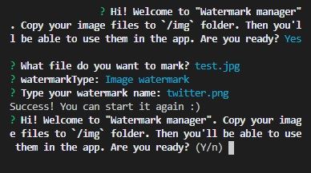

<p align="center">

</p>


# <p align="center">👨‍💻 Node watermark generator</p>
<p align="center">Project for learning Node.js</p>

</br>

## Table of Contents

- [What's this project about?](#about)
- [Technologies used](#technologies)
- [What I learned?](#what)
- [Interesting code snippet](#interesting)
- [Installation and quick start](#install)

</br>

## <a name="about"></a>What's this project about?

This is a project for generating watermarks in a photo in text or graphic form. The application needs a photo posted to the `/img` folder. The program in the next steps will ask for the name of the photo and the type of watermark. Finally, it will save the new photo in the main folder.

</br>

## <a name="technologies"></a>Technologies used
- JavaScript
- Node.js
- Jimp
- Inquirer
- GIT

</br>

## <a name="what"></a>What I learned?

- what node.js can be used for,
- use the operating system Node module (`const os = require('os')`),
- difference between CommonJS and ES6 import/export,
- work with experimental mode in node.js (`--experimental-modules`),
- use the [Node.js documentation](https://nodejs.org/api/),
- work with the built-in module for using files and folders (`const fs = require('fs')`),
- use [Jimp](https://www.npmjs.com/package/jimp) - package for handling graphic files (resizing, change quality, brightness, colors, adding text, as well as combining images),
- work with the built-in `process` object (`stdin`, `stdout`, `stderr`),
- use [Inquirer](https://www.npmjs.com/package/inquirer) instead of `process` object - package allows easily ask questions in the console, improve communication with users,


</br>

## <a name="interesting"></a>Interesting code snippet (for me of course 😉)
- add a image watermark function:

```js
const Jimp = require('jimp');

const addImageWatermarkToImage = async function (inputFile, outputFile, watermarkFile) {
  try {
    const image = await Jimp.read(inputFile);
    const watermark = await Jimp.read(watermarkFile);
    const x = image.getWidth() / 2 - watermark.getWidth() / 2;
    const y = image.getHeight() / 2 - watermark.getHeight() / 2;

    image.composite(watermark, x, y, {
      mode: Jimp.BLEND_SOURCE_OVER,
      opacitySource: 0.5,
    });
    await image.quality(100).writeAsync(outputFile);
    console.log('Success! You can start it again :)');
    startApp();
  }
  catch (err) {
    console.log('Something went wrong...');
  }
};
```

</br>

## <a name="install"></a>Installation and quick start

- use the package manager [npm](https://www.npmjs.com/get-npm) or [yarn](https://classic.yarnpkg.com/en/) to install dependencies:

```bash
npm install // yarn install

or

npm i
```
- run app:

```bash
npm start

or

yarn start
```


</br>
</br>

  *project implemented as part of the 9-month [Web Developer Plus](https://kodilla.com/pl/bootcamp/webdeveloper/?type=wdp&editionId=309) course organized by [Kodilla](https://drive.google.com/file/d/1AZGDMtjhsHbrtXhRSIlRKKc3RCxQk6YY/view?usp=sharing)


